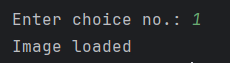
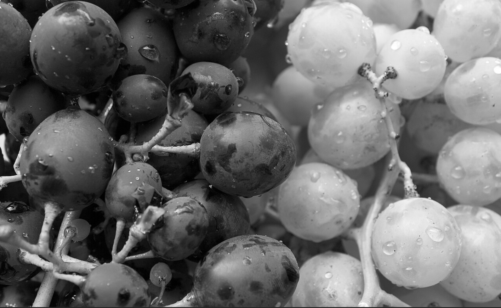

A Python-based image processing application that allows users to perform a variety of image manipulation operations.
It combines file selection using Tkinter with a menu-driven interface in the terminal to apply different transformations to images.


## 🛠️ Features

The application supports the following operations:

1. Load Image
2. Display Image
3. Save Image
4. Convert to Grayscale
5. Color Inversion
6. Adjust Brightness
7. Resize Image
8. Crop Image
9. Rotate Image
10. Flip Image
11. Apply Blur
12. Edge Detection
13. Draw Shapes (Rectangle, Line, Circle)
14. Add Text to Image
15. Exit Program


## 🧰 Technologies Used

* Python
* OpenCV (Image Processing)
* Tkinter (File Dialog GUI)
* NumPy (Array Operations)

---

## ▶️ How to Run

1. Install required libraries:

```
pip install opencv-python numpy
```

2. Run the program:

```
python main.py
```

3. Use the file dialog to load an image, then select operations from the terminal menu.


---

## 🎯 Learning Outcomes

* Understanding of image processing techniques using OpenCV
* Working with NumPy for pixel-level operations
* Combining GUI elements with command-line interaction
* Implementing multiple image transformations in a single application

Some examples are given below to show how it works:
### After the image is loaded:

### Use the display buttton everytime you want to see the progress:

### Applying Grayscale:

### Applying Color Inversion:


Note: Everytime the display dialog comes in you can close it by pressing any button if you want to do further edits.
